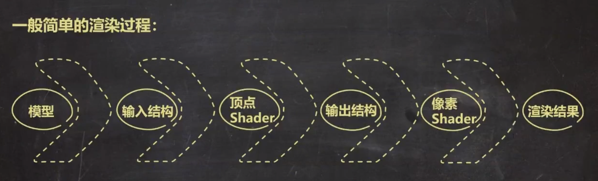
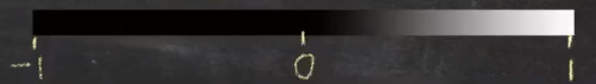
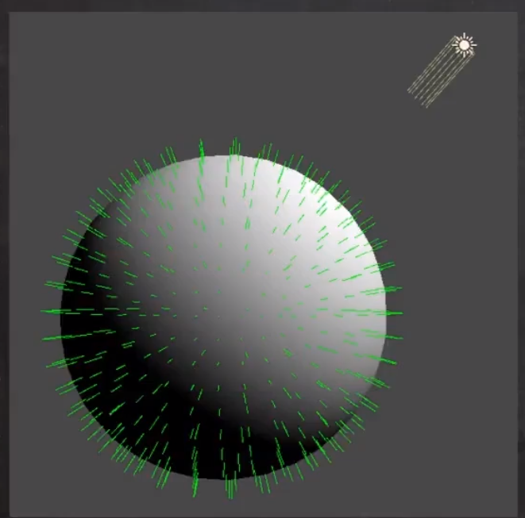
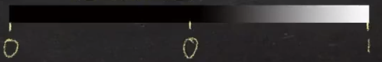
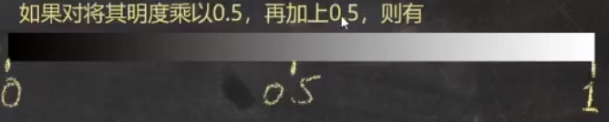
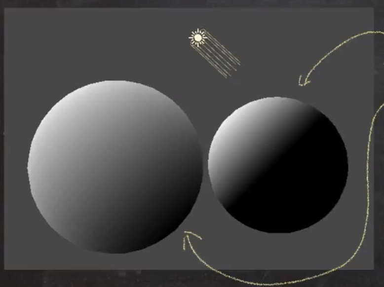
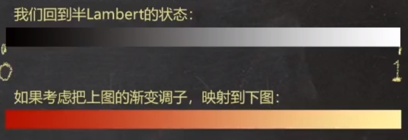
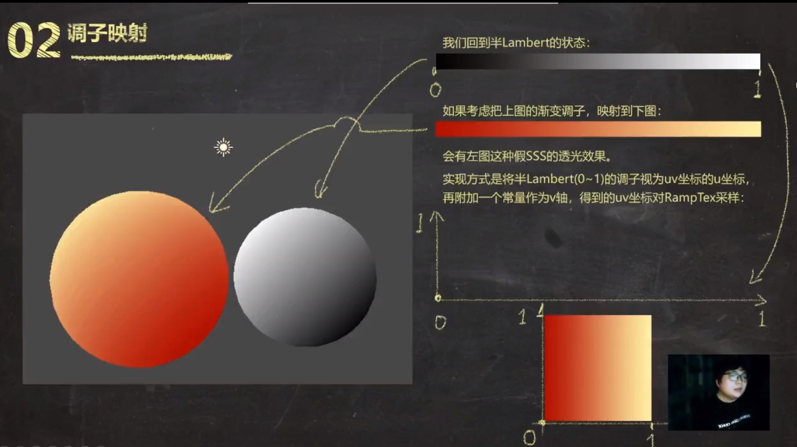
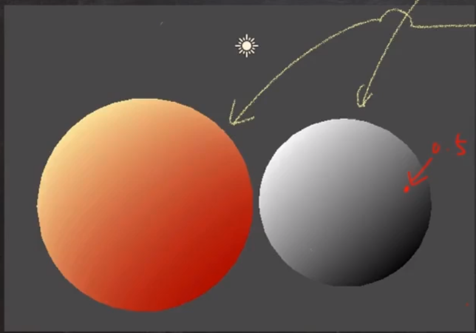

# 美术向TA第1课
[[美术向TA]]

## 新建工程项目

界面设置

console报红字则出bug

## 1. 黑话

1. 结构（Struct）：一些相关数据的组织方式，例如ABD的DG和type
2. 标量（Scalar）：只有大小，没有方向的量，如年龄，体重等
3. 向量（Vector）：既有大小，也有方向的量，如力，速度等。理论上不存在无大小只有方向的量，但存在有大小无现实意义的量，这里做归一化处理
4. 点乘/点积/Dot：两向量间的一种运算方式，==结果为一标量==，具有良好的几何含义，应该是以法线为底
   1. 结果意义为：一个向量在另一个向量上的投影长度
   2. 结果的图形学表现为：两向量，方向同时 >> 结果 = 1(assets/assets/白色)，方向相反 >> 结果 = -1(assets/黑色)，方向垂直 >> 结果 = 0(assets/黑色)  即cos值，同向cos0 =1，反向cos180=-1，垂直cos90=0
5. 映射：两个集合，元素间相互对应的关系
6. UV，看作坐标，根据坐标在贴图上做采样

## 2. 渲染时发生了什么——简单的渲染管线

1. 模型 ：信息：顶点vertex+编号、面（三角面等）、法线、顶点色

2. 输入结构 ：采集需要的模型信息

3. 顶点 Shader：1>将模型每个顶点位置信息逐个换算为每个顶点应在屏幕的位置，2>计算和赋值其他顶点信息，例如：UV,顶点色，顶点法线

4. 输出结构：输出结构通过顶点Shader处理后导入再输出到像素Shader

5. 像素Shader：每一格都会根据顶点Shader中定义的方法去计算其色彩，全算完即最终渲染结果

6. 渲染结果

光照作用到像素Shader的过程：例如手游多用平行光，如何用数值定义平行光，其具有亮度和颜色，即RGB颜色（即一个三维向量定义？），方向光再加一个三维向量定义方向，即 一个颜色+一个方向 定义一个方向光，方向光会被引擎作为参数传递给全体Shader

## 第一束光

根据向量点成的图形学含义，我们令：

* 模型表面的垂直方向为向量nDir（即：法线方向）normal direction
* 令光照方向的反方向为向量IDir（即：LightDir)
* 令nDir·IDir（两者点乘）结果为像素输出；

则有如左图的光照表现，其中：

* 最亮处：值为1，纯白
* 明暗交界处：值为0，纯黑
* 暗部：值为负数，亦为黑

  

1. 兰伯特光照模型负数是个无意义的亮度，所以我们通常把结果为负数的值，都改为0

* 则有：Max(assets/0, nDir * IDir)  用来表示0-1之间的调子变化，即取0-1最大值

2. 半Lambert光照模型

* 优点：比Lambert透气，不至于暗部死黑

* 缺点：显然和素描老师教的不一样

  

调子映射：

会有下图这种假SSS的透光效果。实现方式是将半Lambert(assets/0~1)的调子视为uV坐标的u坐标，再附加一个常量作为v轴，得到的uv坐标对RampTex采样

再将第一步映射的色彩映射到下图

把映射后的值传给UV节点，==一般把上面的值传给U方向==，贴图必须要有两个值才能采样

8.13 需要总结每一步的制作流程

